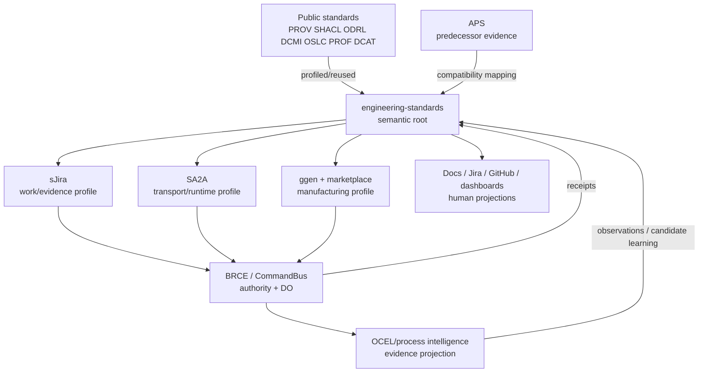

# Root Architecture

## Purpose

Show the authority, projection, and evidence topology of `engineering-standards`.

## System context



## Authority layers

### Semantic authority

Owned by:
- `MANIFEST.json`;
- root RDF profile;
- SHACL/schema admission contracts;
- normative root protocol.

It defines identity, invariants, standing vocabulary, authority distinctions, and projection law.

### Projection authority

Docs, Jira/GitHub, SA2A messages, generated code/config, OpenAPI, database schema, AI context, and plans may be authoritative **inside a declared bounded technical interface** but cannot redefine the root semantics.

Every derivable projection should bind its source and generator identity.

### Consequence authority

Only an explicit broker/policy admits DO. The broker consumes candidates/proofs/plans/capabilities but does not derive permission merely from them.

### Evidence authority

Receipts and independent courts establish observed facts at declared coordinates. A receipt is evidence, not standing by declaration; a standing assertion is admitted from the evidence court.

## Data flow

```text
public prior art + observations
       |
       v
root semantic graph / project profile
       |
       +--> sJira work projection
       +--> SA2A transport projection
       +--> documentation projection
       +--> code/config/interface generation
       |
       v
SELECT / CONSTRUCT
       |
       v
authority decision
       |
       v
DO
       |
       +--> evidence receipt
       +--> object-centric process event
       |
       v
replay / independent verification
       |
       v
bounded standing
       |
       v
root/project learning candidate
```

## Repository internal architecture

```text
MANIFEST.json
AGENTS.md
semantic/
  semantic-engineering-profile.ttl   canonical vocabulary
  semantic-engineering-shapes.ttl    RDF admission
  schemas/                            lifecycle JSON contracts
  profiles/                           downstream/public profiles
  compat/                             predecessor mappings
process/                              normative human projections
code/                                 construction profiles
ai/                                   interaction/context profile
templates/                            downstream adoption bootstrap
scripts/                              qualification courts
docs/                                 ADRs/explanations/plans/solutions
archive/, agent-transcripts/          historical evidence
```

## Standing boundaries

The root repository can earn repository-semantic conformance standing by executing its own court. That does not establish:
- downstream runtime conformance;
- SA2A transport execution;
- Jira mutation;
- CommandBus/BRCE consequence;
- deployment/publication;
- cross-repository composition standing.

Each downstream subject requires its own court and receipt.

## Change propagation

A root change should propagate through generated/profile surfaces:

```text
root change
-> admission court
-> compatibility/profile impact
-> regenerated projections
-> downstream exact-head courts
-> new receipts
```

A corrected root statement is not automatically a verified downstream state.
